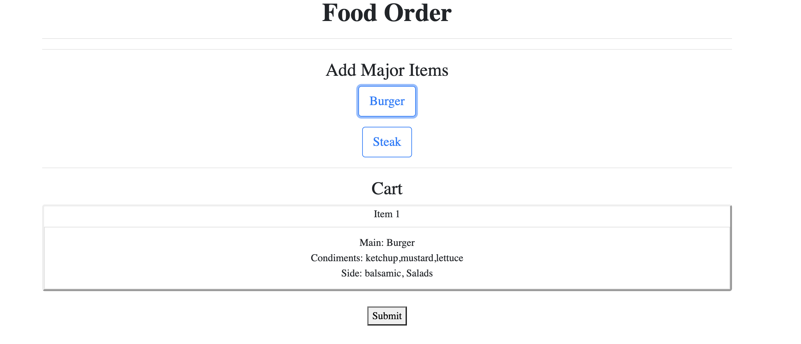

# FoodOrder

This project was generated with [Angular CLI](https://github.com/angular/angular-cli) version 11.2.9.

###### Overall view

Create an Angular 11 app containing a simple online order form for a restaurant. The menu
should contain two major items - burgers and steaks.

Requirements:

Main Items:
- Burgers: If this is chosen, the app should allow the user to choose the following options
    - Condiments: Checkbox of ketchup, mustard, lettuce and tomato
    - Choice of sides: Fries or Salad
- Steak: If this is chosen, the app should allow the user to choose the following
    - Doneness: Dropdown box of rare, medium or well done
    - Choice of sides: Baked Potato or Salad
    
Side Options:
- Salad: caesar or balsamic
- Fries: small or large
- Baked Potato: number
    
Note: Assuming side dish is required to go with the main item

###### Future TODO

- Hardcoded requirements (currently in food-form components) should be replaced with proper API call or be relocated in other json files.
- Edit and Delete item from Cart could be added. (Potentially adding Mode into food-summary component) 

## Development server

Run `ng serve` for a dev server. Navigate to `http://localhost:4200/`. The app will automatically reload if you change any of the source files.

## Code scaffolding

Run `ng generate component component-name` to generate a new component. You can also use `ng generate directive|pipe|service|class|guard|interface|enum|module`.

## Build

Run `ng build` to build the project. The build artifacts will be stored in the `dist/` directory. Use the `--prod` flag for a production build.

## Running unit tests

Run `ng test` to execute the unit tests via [Karma](https://karma-runner.github.io).

## Running end-to-end tests

Run `ng e2e` to execute the end-to-end tests via [Protractor](http://www.protractortest.org/).

## Further help

To get more help on the Angular CLI use `ng help` or go check out the [Angular CLI Overview and Command Reference](https://angular.io/cli) page.

